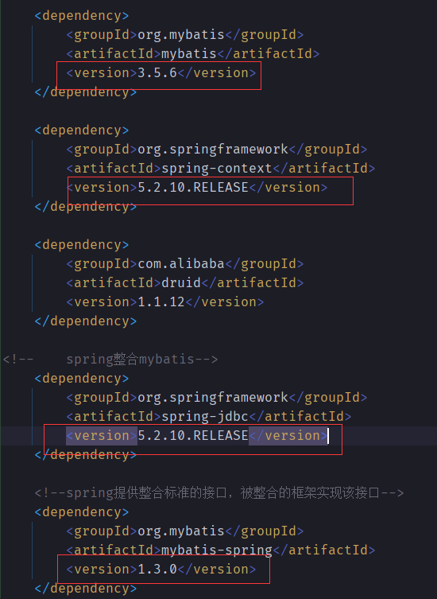
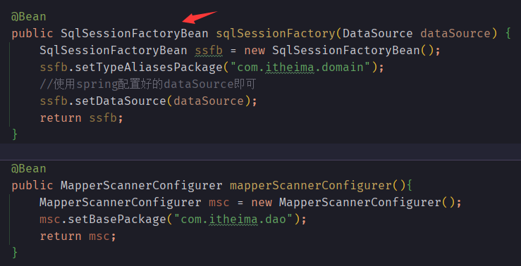
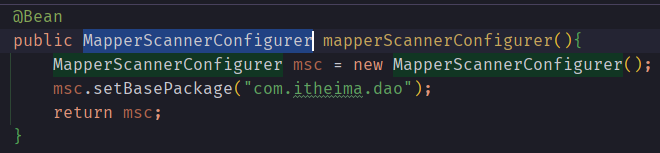
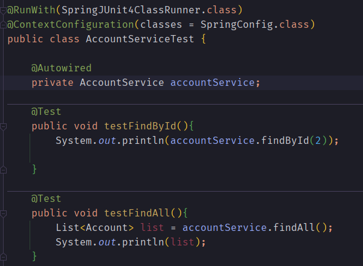

### 一、spring整合mybatis框架

> 注意事项：
> - spring提供整合标准接口，由被整合框架提供实现类，注意导入maven坐标的时候要版本对应，否则会因细节而报错，例如
> 
>  

> 整合的好处：
> 一个配置文件变成了一个类，就能把所有有关配置的东西全部加载进来。
> 
> - `SqlSessionFactory`对应mybatis核心配置文件的部分内容
> 
> mybatis关键的是把`SqlSessionFactory`建造出来，才有后续的操作，但是mybatis核心配置文件需要配置的东西太多了，因此mybatis提供了
> 一个`SqlSessionFactoryBean`，只需要配置主要的几个设置，其他默认值即可，如下图。
> 
>  
> 
> 其中`setTypeAliasesPackage()`方法是配置`<typeAliases>`、`setDataSource()`方法是配置`<dataSource>`
> 
> `<dataSource>`数据源的配置是通过注入的方式加载进来的，就是对应方法的形参`DataSource dataSource`。
> 
> 但是`<mappers>`的配置不属于`SqlSessionFactory`的范畴，故此需要另起一个bean，使用`MapperScannerConfigurer`进行配置即可，如下图。
>
>  

### 二、spring整合junit

> 如下图
> 
>  

